# PhantomWall Cloud Threat - Architecture Diagram

## System Architecture Overview

## Data Flow Diagram

```mermaid
sequenceDiagram
    participant Attacker as 🎯 Attacker
    participant Honeypot as 🍯 Honeypot EC2
    participant Suricata as 🔍 Suricata IDS
    participant CW as ☁️ CloudWatch
    participant Lambda as ⚡ Lambda Ingest
    participant DDB as 💾 DynamoDB
    participant API as 🌐 API Gateway
    participant Frontend as 🖥️ Dashboard
    participant User as 👤 User
    participant AI as 🤖 Bedrock AI

    %% Attack Detection Flow
    Attacker->>Honeypot: Scan/Attack (Port 22, 80)
    Honeypot->>Suricata: Network Traffic
    Suricata->>Suricata: Process with Rules
    Suricata->>CW: Write eve.json via Agent
    CW->>Lambda: Trigger on Log Events
    Lambda->>Lambda: Parse & Transform
    Lambda->>DDB: Write Event Records
    
    %% User Query Flow
    User->>Frontend: View Dashboard
    Frontend->>API: GET /events
    API->>Lambda: Invoke Suricata API
    Lambda->>DDB: Query Events
    DDB-->>Lambda: Return Results
    Lambda-->>API: Format Response
    API-->>Frontend: JSON Data
    Frontend-->>User: Display Charts & Alerts
    
    %% AI Assistant Flow
    User->>Frontend: Ask AI Question
    Frontend->>API: POST /chat
    API->>Lambda: Invoke Chat Lambda
    Lambda->>DDB: Query Context
    DDB-->>Lambda: Event Data
    Lambda->>AI: InvokeModel with Context
    AI-->>Lambda: AI Response
    Lambda-->>API: Formatted Answer
    API-->>Frontend: AI Analysis
    Frontend-->>User: Display Insights
```

## Component Details

### Frontend Layer
- **Technology**: React + Vite
- **Hosting**: AWS Amplify
- **Features**: 
  - Real-time threat dashboard
  - Interactive charts (Attack Timeline, Security Charts)
  - Alert management with filtering
  - AI-powered chat assistant
  - Responsive data tables

### API Layer
- **Type**: API Gateway HTTP API
- **Protocol**: REST over HTTPS
- **CORS**: Enabled for web access
- **Endpoints**:
  - `/events` - Query security events
  - `/chat` - AI assistant interaction
  - `/alerts` - Alert management

### Compute Layer
- **Runtime**: Python 3.11
- **Functions**:
  1. **Suricata Ingest** - Processes CloudWatch logs → DynamoDB
  2. **Suricata API** - Queries events for dashboard
  3. **Chat Assistant** - AI-powered threat analysis
  4. **Alert Indexer** - Fast alert processing & indexing

### Data Layer
- **Suricata Events Table**:
  - Partition Key: event_date
  - Sort Key: event_id
  - Billing: Pay-per-request
  
- **Alerts Table**:
  - Design: PK/SK pattern
  - GSI: src_ip-index, signature-index
  - TTL: 30-day automatic expiration

### Honeypot Infrastructure
- **Instance**: EC2 Ubuntu 22.04 LTS (t3a.medium)
- **IDS**: Suricata with full ruleset
- **Exposure**: Intentionally permissive (SSH, HTTP)
- **Logging**: CloudWatch Agent → eve.json streaming

### Security Features
- IAM roles with least-privilege access
- IAM Access Analyzer for monitoring
- CloudWatch Logs encryption
- Security groups with controlled ingress
- Automatic alert TTL (30 days)

## Infrastructure as Code
- **Tool**: Terraform
- **Workspaces**: dev, prod
- **State Management**: Remote state support
- **Modular Design**: Separate .tf files per service

## Cost Optimization
- Pay-per-request DynamoDB billing
- Lambda with right-sized memory/timeout
- CloudWatch log retention limits (14-30 days)
- Auto-scaling with Amplify
- t3a instances for cost savings

## Monitoring & Observability
- Centralized CloudWatch Logs
- Lambda execution metrics
- API Gateway access logs
- DynamoDB performance metrics
- Bootstrap & runtime logging separation

