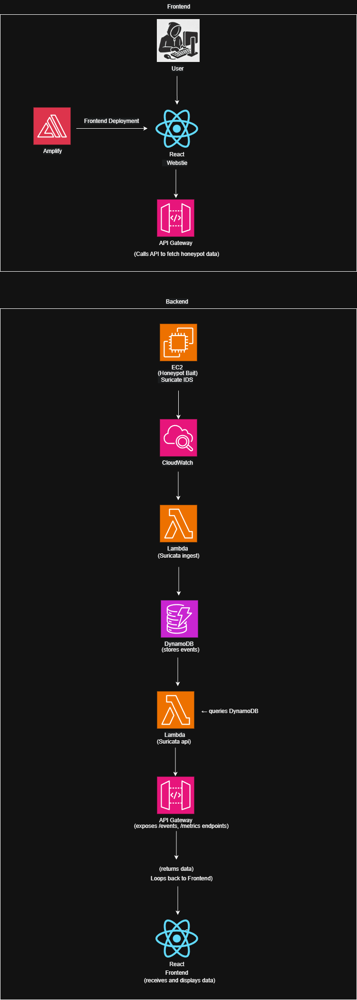

# PhantomWall

A cloud-native honeypot security platform that deploys intelligent decoy systems to detect, analyze, and respond to cyber threats in real-time using AWS serverless architecture.

---

## Table of Contents

1. [Introduction](#introduction)
2. [Features](#features)
3. [Architecture Overview](#architecture-overview)
4. [Architecture Diagram](#architecture-diagram)
5. [Technologies Used](#technologies-used)
6. [Prerequisites](#prerequisites)
7. [Setup & Deployment](#setup--deployment)
8. [Usage](#usage)
9. [Future Enhancements](#future-enhancements)

---

## Introduction

**PhantomWall** is a serverless honeypot-as-a-service platform built on AWS that automatically detects and analyzes malicious activity. It combines honeypot technology with modern cloud architecture to provide real-time threat intelligence, automated incident response, and comprehensive security analytics through an interactive dashboard.

The platform leverages Suricata IDS, AWS Lambda, DynamoDB, and API Gateway to create a scalable, cost-effective security monitoring solution suitable for organizations of any size.

---

## Features

- **Serverless Honeypot Infrastructure** - EC2-based honeypots running Suricata IDS with automatic log streaming
- **Real-time Threat Detection** - Continuous monitoring and analysis of network traffic and attack patterns
- **Automated Data Pipeline** - CloudWatch → Lambda → DynamoDB ingestion for low-latency threat data processing
- **RESTful API** - HTTP API Gateway exposing threat events and metrics for dashboard consumption
- **Interactive Dashboard** - React-based frontend with real-time visualizations, threat maps, and attack timelines
- **AI-Powered Analysis** - AWS Bedrock integration for intelligent threat summaries and security insights
- **Security Scanning** - Automated GitHub Actions workflow to prevent credential leaks
- **Infrastructure as Code** - Complete Terraform deployment with modular, reusable components
- **Multi-environment Support** - Variable-based deployment for dev/staging/prod environments with standardized naming conventions

---

## Naming Convention

PhantomWall follows the **DarkTracer naming standard** for consistent, professional resource naming across all AWS infrastructure:

### **Pattern:**
```
{project-name}-{resource-type}-{environment}
```

### **Examples:**
- `phantomwall-lambda-api-role-dev` - IAM role for API Lambda in dev
- `phantomwall-ec2-honeypot-sg-prod` - Security group for honeypot in production
- `phantomwall-dynamodb-events-staging` - DynamoDB table in staging
- `phantomwall-budget-monthly-dev` - AWS Budget for dev environment

### **Environment Values:**
- `dev` - Development environment
- `staging` - Staging/testing environment
- `prod` - Production environment

### **Benefits:**
- ✅ Consistent naming across all AWS resources
- ✅ Easy identification of resource purpose and environment
- ✅ Professional appearance in AWS Console
- ✅ Simplified cost tracking and resource management
- ✅ Portfolio-ready infrastructure for recruiters

---

## Architecture Overview

1. **Honeypot EC2 instances** are deployed running Ubuntu with Suricata IDS configured to monitor network traffic
2. **Suricata logs** (`eve.json`) are streamed to CloudWatch Logs in near real-time
3. **Lambda ingest function** processes CloudWatch log streams and normalizes threat data
4. **DynamoDB** stores structured event data with indexed queries for fast retrieval
5. **API Gateway** exposes RESTful endpoints (`/events`, `/metrics`, `/chat`) for frontend consumption
6. **Lambda API functions** query DynamoDB and return threat intelligence to the dashboard
7. **AWS Bedrock** provides AI-powered threat analysis and contextual security insights
8. **React Frontend** (deployed via AWS Amplify) displays interactive threat visualizations and analytics
9. **GitHub Actions** automatically scans code for security vulnerabilities before deployment

---

## Architecture Diagram



**Data Flow:**
```
User → React Dashboard (Amplify)
         ↓
     API Gateway
         ↓
     Lambda (API)
         ↓
     DynamoDB ← Lambda (Ingest) ← CloudWatch Logs ← Suricata ← EC2 Honeypot
```

---

## Technologies Used

### AWS Services
- **AWS EC2** - Honeypot hosting
- **AWS Lambda** - Serverless data processing and API handlers
- **Amazon DynamoDB** - NoSQL database for threat event storage
- **Amazon CloudWatch** - Log aggregation and monitoring
- **AWS API Gateway** - HTTP API endpoint management
- **AWS Amplify** - Frontend hosting and CI/CD
- **AWS Bedrock** - AI/ML threat analysis
- **AWS IAM** - Identity and access management
- **Amazon S3** - Script storage and static assets

### Application Stack
- **React** - Frontend framework
- **Vite** - Build tool and development server
- **Terraform** - Infrastructure as Code
- **Python 3.11** - Lambda function runtime
- **Suricata IDS** - Network intrusion detection
- **Ubuntu 22.04 LTS** - Honeypot operating system

### Development & Security
- **GitHub Actions** - CI/CD automation
- **Gitleaks** - Secret scanning
- **Git** - Version control

---

## Prerequisites

- **AWS Account** with appropriate IAM permissions for:
  - EC2, Lambda, DynamoDB, API Gateway, CloudWatch, Amplify, S3, IAM
- **Terraform** >= 1.0 (for infrastructure deployment)
- **AWS CLI** configured with credentials
- **Node.js** >= 18.x (for frontend development)
- **Git** (for version control)
- **GitHub Account** (for repository hosting and Actions)
- Basic familiarity with AWS services and Terraform

---

## Setup & Deployment

### 1. Clone the Repository
```bash
git clone https://github.com/Heero04/phantomwall.git
cd phantomwall
```

### 2. Configure AWS Credentials
```bash
aws configure
# Enter your AWS Access Key ID, Secret Access Key, and default region
```

### 3. Set Up Terraform Variables
```bash
cp terraform.tfvars.example terraform.tfvars
# Edit terraform.tfvars with your configuration:
# - aws_region (e.g., "us-east-1")
# - project_name (e.g., "phantomwall")
# - environment (e.g., "dev", "staging", or "prod")
# - subnet_tag_value (or public_subnet_id)
# - amplify_repo (optional, for frontend deployment)
# - budget_alert_email (for cost monitoring)
```

### 4. Initialize Terraform
```bash
terraform init
```

### 5. Review Deployment Plan
```bash
# For development environment
terraform plan -var="environment=dev"

# For production environment
terraform plan -var="environment=prod"
```

### 6. Deploy Infrastructure
```bash
# Deploy to development
terraform apply -var="environment=dev" -auto-approve

# Deploy to production
terraform apply -var="environment=prod" -auto-approve
```

### 7. Destroy Infrastructure (when needed)
```bash
# Destroy development environment
terraform destroy -var="environment=dev" -auto-approve

# Destroy production environment
terraform destroy -var="environment=prod" -auto-approve
```

### 8. Deploy Frontend (Optional)
```bash
cd frontend
npm install
npm run build
# Configure Amplify in AWS Console or use amplify_repo variable in terraform.tfvars
```

### 8. Retrieve API Endpoint
```bash
terraform output suricata_api_url
# Use this URL to configure frontend/.env
```

---

## Usage

### Accessing the Dashboard
1. Navigate to your Amplify app URL (output from Terraform)
2. View real-time threat events, attack timelines, and geographic threat maps
3. Use filters to search by event type, source IP, or date range
4. Interact with the AI chat assistant for threat analysis

### Monitoring Honeypot Activity
```bash
# SSH into honeypot (if key-based access configured)
ssh -i phantomwall_honeypot_key.pem ubuntu@<honeypot-public-ip>

# Or use AWS Systems Manager Session Manager (recommended)
aws ssm start-session --target <instance-id>

# Check Suricata status
sudo systemctl status suricata

# View live Suricata logs
sudo tail -f /var/log/suricata/eve.json
```

### Querying Threat Data via API
```bash
# Get recent events
curl "https://<api-gateway-url>/events?date=2026-01-25&limit=10"

# Get metrics summary
curl "https://<api-gateway-url>/metrics?date=2026-01-25"

# Chat with AI assistant (POST request)
curl -X POST "https://<api-gateway-url>/chat" \
  -H "Content-Type: application/json" \
  -d '{"message": "Summarize recent threats"}'
```

### Viewing CloudWatch Logs
```bash
# Stream Suricata logs
aws logs tail /honeypot/suricata --follow

# Stream bootstrap logs (for debugging)
aws logs tail /honeypot/bootstrap --follow
```

---

## Future Enhancements

See [FUTURE-OPTIMIZATIONS.md](FUTURE-OPTIMIZATIONS.md) for the complete roadmap.

### High Priority
- **Terraform Validation Workflow** - Automated infrastructure code validation via GitHub Actions
- **Multi-region Deployment** - Geographic distribution for global threat detection
- **Advanced Analytics** - Machine learning models for anomaly detection and threat prediction
- **Real-time Alerting** - SNS/Slack/email notifications for critical security events
- **Multi-tenancy Support** - SaaS platform for multiple organizations

### Security Enhancements
- **AWS WAF Integration** - Automated threat blocking and IP reputation management
- **GuardDuty Integration** - Enhanced threat intelligence correlation
- **Security Hub Compliance** - Centralized security findings and compliance reporting
- **Secrets Rotation** - Automated credential rotation with AWS Secrets Manager

### Operational Excellence
- **Cost Optimization** - Right-sizing resources and implementing cost monitoring
- **Performance Monitoring** - APM integration with AWS X-Ray and CloudWatch Insights
- **Automated Backups** - DynamoDB point-in-time recovery and S3 versioning
- **Blue/Green Deployments** - Zero-downtime deployment strategy

### Platform Features
- **User Authentication** - Cognito-based RBAC and SSO integration
- **Custom Threat Rules** - User-defined Suricata rules and alert configurations
- **API Rate Limiting** - Throttling and quota management
- **Data Export** - CSV/JSON export capabilities for threat intelligence sharing

---

## Project Structure

```
phantomwall/
├── .github/workflows/       # GitHub Actions CI/CD workflows
├── backend/                 # Backend API routes (Node.js)
├── frontend/                # React dashboard application
│   ├── src/
│   │   ├── components/     # React components
│   │   └── services/       # API service clients
│   └── amplify.yml         # AWS Amplify build configuration
├── lambda/                  # AWS Lambda functions
│   ├── alert-indexer/      # Alert indexing function
│   ├── chat_assistant/     # Bedrock chat handler
│   ├── suricata_api/       # API query handler
│   └── suricata_ingest/    # Log ingestion processor
├── terraform/               # Additional Terraform modules
├── Diagram/                 # Architecture diagrams
├── *.tf                     # Terraform infrastructure definitions
├── terraform.tfvars.example # Example configuration
├── CHANGELOG.md             # Version history
├── FUTURE-OPTIMIZATIONS.md  # Enhancement roadmap
└── README.md               # This file
```

---

## Contributing

This is currently a private repository. For questions or collaboration inquiries, please contact the repository owner.

---

## License

This project is private and proprietary. All rights reserved.

---

## Support

For issues, questions, or feature requests:
- Check [CHANGELOG.md](CHANGELOG.md) for recent updates
- Review [FUTURE-OPTIMIZATIONS.md](FUTURE-OPTIMIZATIONS.md) for planned features
- Contact: [@Heero04](https://github.com/Heero04)

---

## Acknowledgments

- **Suricata Project** - Open-source IDS/IPS engine
- **AWS** - Cloud infrastructure platform
- **React Community** - Frontend framework and ecosystem
- **Terraform** - Infrastructure as Code tooling

---

**Built with ☁️ by [Heero04](https://github.com/Heero04)**
