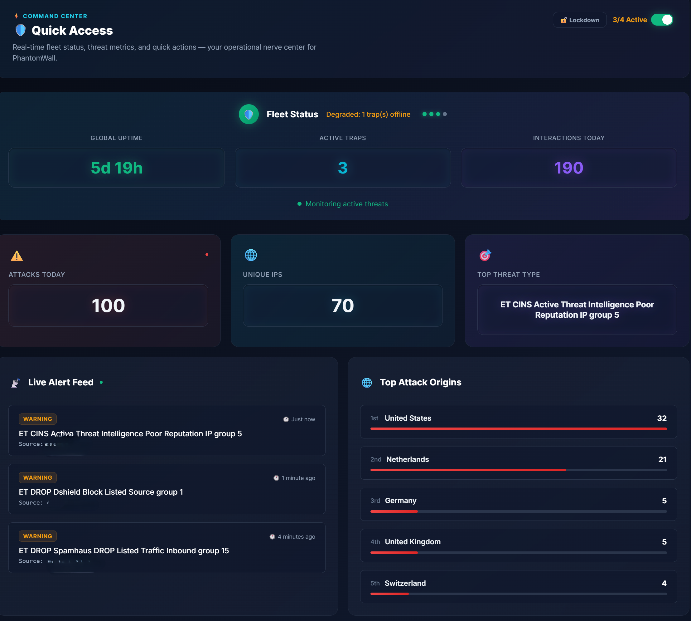
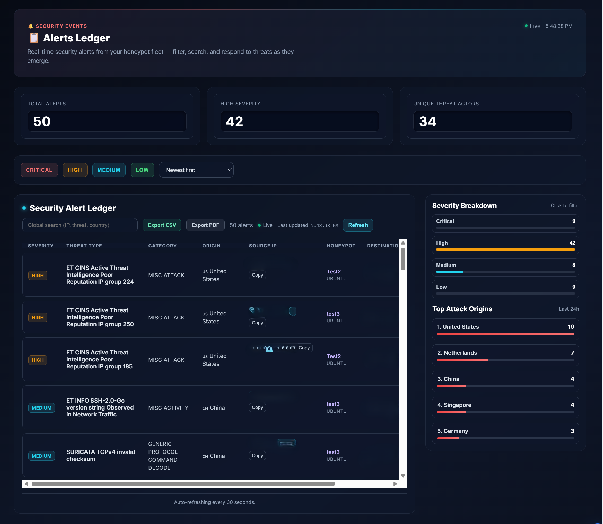
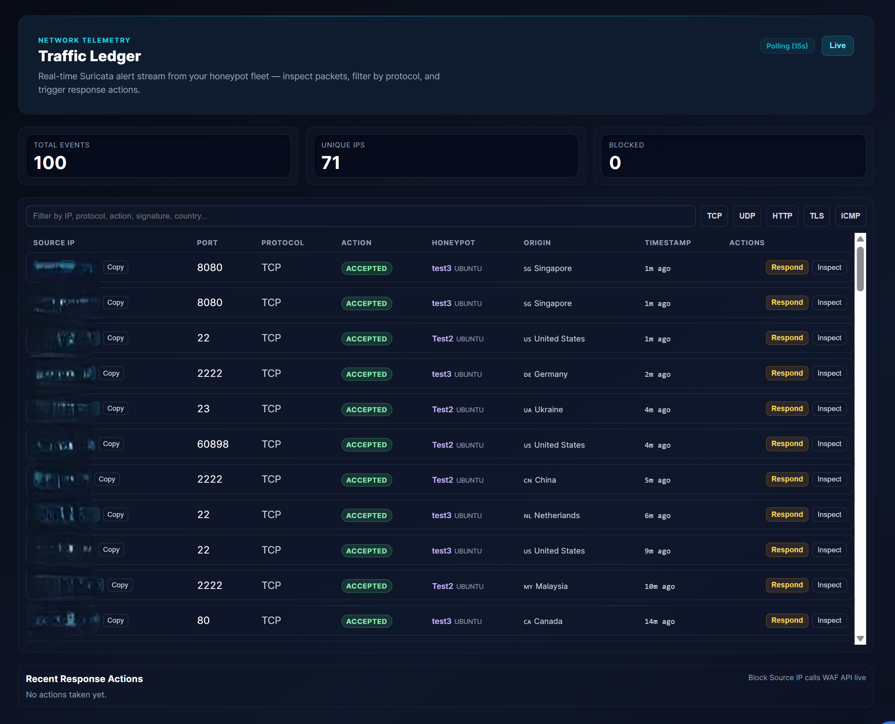
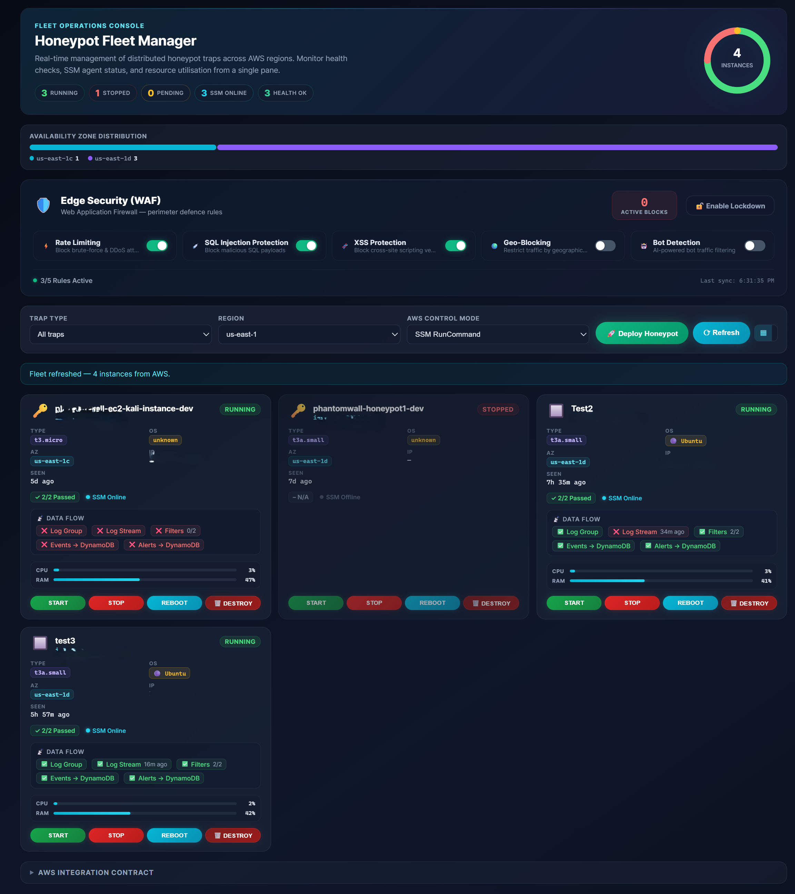
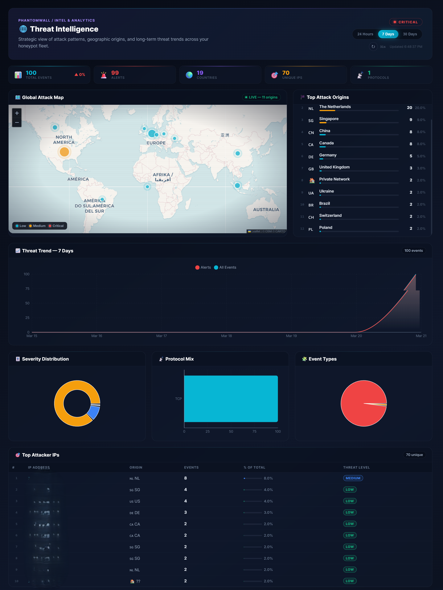
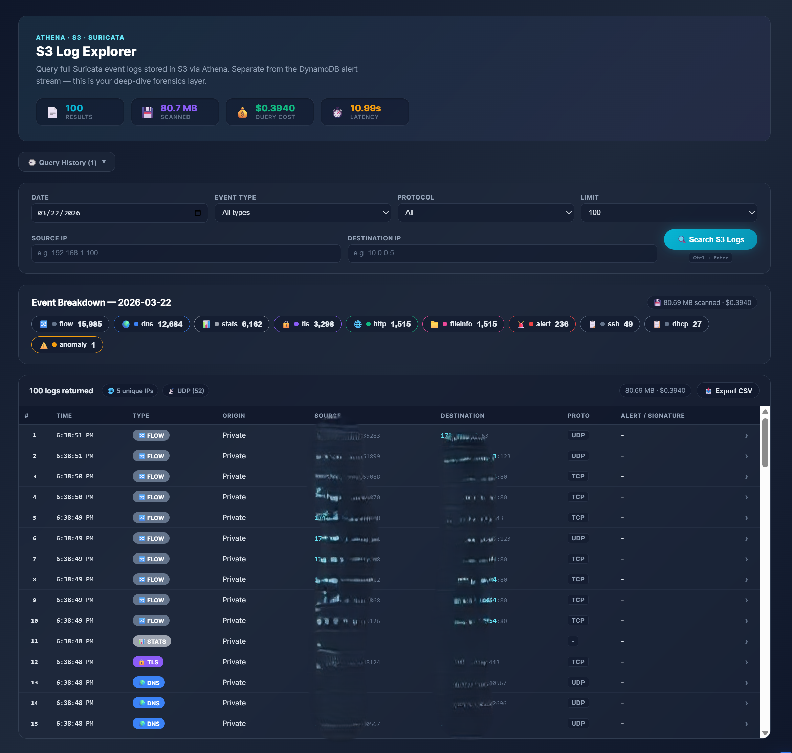
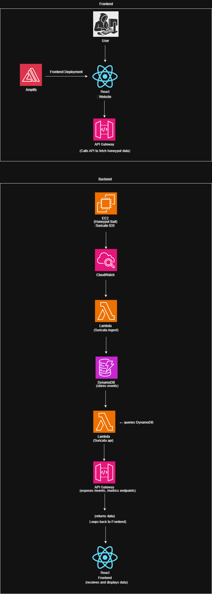

# PhantomWall

A cloud-native honeypot security platform that deploys intelligent decoy systems to detect, analyze, and respond to cyber threats in real-time using AWS serverless architecture.

---

## Table of Contents

1. [Introduction](#introduction)
2. [Screenshots](#screenshots)
3. [Features](#features)
4. [Architecture Overview](#architecture-overview)
5. [Architecture Diagram](#architecture-diagram)
6. [Technologies Used](#technologies-used)
7. [Prerequisites](#prerequisites)
8. [Setup & Deployment](#setup--deployment)
9. [Usage](#usage)
10. [Future Enhancements](#future-enhancements)

---

## Introduction

**PhantomWall** is a serverless honeypot-as-a-service platform built on AWS that automatically detects and analyzes malicious activity. It combines honeypot technology with modern cloud architecture to provide real-time threat intelligence, automated incident response, and comprehensive security analytics through an interactive dashboard.

The platform leverages Suricata IDS, AWS Lambda, DynamoDB, and API Gateway to create a scalable, cost-effective security monitoring solution suitable for organizations of any size.

---

## Screenshots

### Quick Access Dashboard


### Security Alert Ledger


### Traffic Ledger


### Fleet Manager


### Threat Intelligence


### Log Explorer


---

## Features

### Core Platform
- **Fleet Honeypot Deployer** — Deploy/destroy Ubuntu 22.04 or Amazon Linux 2023 honeypots on-demand with customizable trap profiles (SSH, HTTP, Telnet, RDP, DNS, FTP, Multi-port)
- **Suricata IDS** — 49,000+ ET Open threat rules with automatic interface detection, `suricata-update`, and resilient bootstrap scripts
- **Per-Instance Log Groups** — Each honeypot gets its own CloudWatch log group (`/honeypot/suricata/{instance_id}`) with dedicated subscription filters
- **Data Flow Health Checks** — Real-time pipeline verification per instance: log group, log streams, subscription filters, events pipeline, alerts pipeline — displayed as ✅/❌ checkmarks on Fleet Manager

### Data Pipeline
- **Automated Ingestion** — CloudWatch Logs → Lambda (suricata_ingest) → DynamoDB events table + S3 archive
- **Alert Indexing** — Separate Lambda (alert-indexer) processes Suricata alerts into a dedicated DynamoDB alerts table with GSIs for signature and source IP queries
- **S3 Log Archive** — All Suricata events archived to S3 with Athena queryable format for long-term forensics
- **Real-time Processing** — Subscription filters on per-instance log groups trigger both pipelines simultaneously

### Security & Defense
- **AWS WAF Integration** — WAF ACL with auto-block Lambda that automatically adds malicious IPs to blocklist based on Suricata alerts
- **Cognito Authentication** — User pools, identity pools, and JWT-based auth for dashboard access
- **AWS Budget Alerts** — $30/$50/$75 threshold alerts with email notifications

### Frontend Dashboard
- **Quick Access Dashboard** — Real-time fleet status, active traps, attack counts, unique IPs, top threats, global uptime
- **Security Alert Ledger** — Live alert table with severity, threat type, category, origin country, source IP, honeypot name. Export to CSV/PDF
- **Fleet Manager** — Instance cards with status, OS type, AZ, IP, health checks, SSM status, CPU/RAM meters, data flow checkmarks, start/stop/reboot/destroy actions
- **AI Chat Assistant** — AWS Bedrock-powered threat analysis that summarizes real Suricata telemetry
- **S3 Log Query** — Athena-backed log search across archived events

### Infrastructure
- **Infrastructure as Code** — Complete Terraform deployment with 15+ `.tf` files, modular design, variable-driven
- **Multi-environment Support** — dev/staging/prod via `var.environment` with standardized naming (`phantomwall-{resource}-{env}`)
- **CI/CD Security** — GitHub Actions with Gitleaks secret scanning on every push

---

## Naming Convention

PhantomWall follows the **DarkTracer naming standard** for consistent, professional resource naming across all AWS infrastructure:

### **Pattern:**
```
{project-name}-{resource-type}-{environment}
```

### **Examples:**
- `phantomwall-lambda-api-role-dev` - IAM role for API Lambda in dev
- `phantomwall-ec2-honeypot-sg-prod` - Security group for honeypot in production
- `phantomwall-dynamodb-events-staging` - DynamoDB table in staging
- `phantomwall-budget-monthly-dev` - AWS Budget for dev environment

### **Environment Values:**
- `dev` - Development environment
- `staging` - Staging/testing environment
- `prod` - Production environment

### **Benefits:**
- ✅ Consistent naming across all AWS resources
- ✅ Easy identification of resource purpose and environment
- ✅ Professional appearance in AWS Console
- ✅ Simplified cost tracking and resource management
- ✅ Portfolio-ready infrastructure for recruiters

---

## Architecture Overview

1. **Fleet Deployer** provisions honeypot EC2 instances (Ubuntu 22.04 / Amazon Linux 2023) with Suricata IDS, CW Agent, and trap-specific security groups
2. **Suricata IDS** monitors all network traffic and writes alerts + flow events to `eve.json`
3. **CloudWatch Agent** streams `eve.json` to a **per-instance log group** (`/honeypot/suricata/{instance_id}`)
4. **Subscription Filter → suricata_ingest Lambda** normalizes events and writes to DynamoDB events table + S3 archive
5. **Subscription Filter → alert-indexer Lambda** processes alert-type events into a dedicated DynamoDB alerts table
6. **API Gateway** (HTTP API) exposes RESTful endpoints for the frontend: `/events`, `/fleet/*`, `/waf/*`, `/chat`, `/logs/query`
7. **Lambda API functions** (suricata_api, fleet_manager, waf_api, bedrock_chat, s3_log_query) query DynamoDB/S3 and return data
8. **AWS WAF** protects the API with rate limiting and an IP blocklist auto-populated from Suricata alerts
9. **AWS Bedrock** (Claude) provides AI-powered threat analysis and contextual security insights via the chat assistant
10. **Cognito** handles user authentication with user pools, identity pools, and JWT tokens
11. **React Frontend** (Vite + Tailwind) displays the dashboard, alert ledger, fleet manager, and AI chat
12. **Budget Alerts** monitor AWS spend at $30/$50/$75 thresholds with email notifications
13. **GitHub Actions** automatically scans code for secrets (Gitleaks) on every push

---

## Architecture Diagram



**Data Flow:**
```
                         ┌─────────────────────────────────────────────┐
                         │           React Dashboard (Vite)            │
                         │  Dashboard · Alert Ledger · Fleet Manager   │
                         └──────────────────┬──────────────────────────┘
                                            │
                                    Cognito Auth (JWT)
                                            │
                                     API Gateway (HTTP)
                                       ╱    │    ╲
                          ┌───────────╱     │     ╲───────────────┐
                          │                 │                     │
                   Fleet Manager      Suricata API          WAF API
                   Lambda             Lambda                Lambda
                     │                   │                     │
              ┌──────┴──────┐     DynamoDB Events        WAF Blocklist
              │             │     DynamoDB Alerts         Auto-Block
           EC2 Fleet    Data Flow
           Actions      Health Checks
              │
     ┌────────┴────────────────────────────────────────┐
     │              Honeypot EC2 Instance               │
     │  Suricata IDS → eve.json → CW Agent             │
     └────────────────────┬────────────────────────────┘
                          │
              CloudWatch Log Group
           /honeypot/suricata/{instance_id}
                    ╱           ╲
         Subscription         Subscription
          Filter #1            Filter #2
              │                     │
     suricata_ingest          alert-indexer
        Lambda                   Lambda
         ╱    ╲                    │
   DynamoDB    S3 Archive    DynamoDB Alerts
   (events)   (Athena)       (alerts table)
```

---

## Technologies Used

### AWS Services
- **AWS EC2** — Honeypot hosting (Ubuntu 22.04, Amazon Linux 2023)
- **AWS Lambda** — 8 serverless functions (ingest, alert-indexer, fleet_manager, honeypot_provisioner, suricata_api, waf_api, bedrock_chat, s3_log_query)
- **Amazon DynamoDB** — Events table + Alerts table with GSIs
- **Amazon CloudWatch** — Per-instance log groups, metrics, alarms, dashboards
- **AWS API Gateway** — HTTP API with 10+ routes
- **AWS WAF** — Web ACL, IP blocklist, auto-block from Suricata alerts
- **Amazon Cognito** — User pools, identity pools, JWT authentication
- **AWS Bedrock** — Claude AI for threat analysis chat
- **Amazon S3** — Log archive with Athena-queryable format
- **Amazon Athena** — SQL queries over archived S3 logs
- **AWS Amplify** — Frontend hosting and CI/CD
- **AWS Budgets** — Cost monitoring with threshold alerts
- **AWS IAM** — Least-privilege roles per Lambda function
- **AWS SSM** — Session Manager for secure instance access

### Application Stack
- **React 18** — Frontend framework
- **Vite** — Build tool and dev server
- **Tailwind CSS** — Utility-first CSS framework
- **Terraform** — Infrastructure as Code (15+ .tf files)
- **Python 3.11** — Lambda function runtime
- **Suricata IDS** — Network intrusion detection (49k+ ET Open rules)
- **Ubuntu 22.04 / Amazon Linux 2023** — Honeypot operating systems

### Development & Security
- **GitHub Actions** — CI/CD with Gitleaks secret scanning
- **Git** — Version control (Dev branch workflow)
- **AWS CloudWatch Agent** — Log streaming from EC2 to CloudWatch

---

## Prerequisites

- **AWS Account** with appropriate IAM permissions for:
  - EC2, Lambda, DynamoDB, API Gateway, CloudWatch, Amplify, S3, IAM
- **Terraform** >= 1.0 (for infrastructure deployment)
- **AWS CLI** configured with credentials
- **Node.js** >= 18.x (for frontend development)
- **Git** (for version control)
- **GitHub Account** (for repository hosting and Actions)
- Basic familiarity with AWS services and Terraform

---

## Setup & Deployment

### 1. Clone the Repository
```bash
git clone https://github.com/Heero04/phantomwall.git
cd phantomwall
```

### 2. Configure AWS Credentials
```bash
aws configure
# Enter your AWS Access Key ID, Secret Access Key, and default region
```

### 3. Set Up Terraform Variables
```bash
cp terraform.tfvars.example terraform.tfvars
# Edit terraform.tfvars with your configuration:
# - aws_region (e.g., "us-east-1")
# - project_name (e.g., "phantomwall")
# - environment (e.g., "dev", "staging", or "prod")
# - subnet_tag_value (or public_subnet_id)
# - amplify_repo (optional, for frontend deployment)
# - budget_alert_email (for cost monitoring)
```

### 4. Initialize Terraform
```bash
terraform init
```

### 5. Review Deployment Plan
```bash
# For development environment
terraform plan -var="environment=dev"

# For production environment
terraform plan -var="environment=prod"
```

### 6. Deploy Infrastructure
```bash
# Deploy to development
terraform apply -var="environment=dev" -auto-approve

# Deploy to production
terraform apply -var="environment=prod" -auto-approve
```

### 7. Destroy Infrastructure (when needed)
```bash
# Destroy development environment
terraform destroy -var="environment=dev" -auto-approve

# Destroy production environment
terraform destroy -var="environment=prod" -auto-approve
```

### 8. Deploy Frontend (Optional)
```bash
cd frontend
npm install
npm run build
# Configure Amplify in AWS Console or use amplify_repo variable in terraform.tfvars
```

### 8. Retrieve API Endpoint
```bash
terraform output suricata_api_url
# Use this URL to configure frontend/.env
```

---

## Usage

### Accessing the Dashboard
1. Navigate to your frontend URL (local dev: `http://localhost:5173`, or Amplify app URL)
2. **Quick Access Dashboard** — Real-time fleet status, active traps, attack counts, top threats
3. **Security Alert Ledger** — Live alerts with severity, threat type, source IP, honeypot name. Export CSV/PDF
4. **Fleet Manager** — Deploy/manage honeypots, view data flow health checkmarks per instance
5. **AI Chat Assistant** — Ask questions about recent threats, get AI-powered summaries

### Deploying a Honeypot (Fleet Manager)
1. Open the Fleet Manager page
2. Click **Deploy New Honeypot**
3. Select OS (Ubuntu / Amazon Linux), instance type, trap profile, AZ
4. Give it a name and click Deploy
5. Watch the data flow checkmarks turn green as the pipeline comes online (📡 Log Group → Log Stream → Filters → Events → Alerts)

### Monitoring Honeypot Activity
```bash
# Use AWS Systems Manager Session Manager (recommended)
aws ssm start-session --target <instance-id>

# Check Suricata status
sudo systemctl status suricata

# View live Suricata logs
sudo tail -f /var/log/suricata/eve.json

# View per-instance CloudWatch log group
aws logs tail /honeypot/suricata/<instance-id> --follow
```

### Querying Threat Data via API
```bash
# API Base URL
API="https://k4ddxqs7vi.execute-api.us-east-1.amazonaws.com/prod"

# Get recent events
curl "$API/events?date=2026-03-22&limit=10"

# List fleet instances with data flow health
curl "$API/fleet/instances"

# Chat with AI assistant
curl -X POST "$API/chat" \
  -H "Content-Type: application/json" \
  -d '{"message": "Summarize recent threats"}'

# Get WAF status
curl "$API/waf/status"
```

---

## Future Enhancements

See [FUTURE-OPTIMIZATIONS.md](FUTURE-OPTIMIZATIONS.md) for the complete roadmap and priority list.

### Next Up
- **Update Architecture Diagram** — Create v4 diagram reflecting current deployed infrastructure
- **Add Honeypot Field to CSV Export** — Include honeypot name in Alert Ledger exports
- **Add Honeypot Field to S3 Archive** — Instance ID in archived logs for per-honeypot filtering
- **AWS WAF Dashboard Page** — Dedicated page for WAF rules, blocked IPs, and auto-block management
- **Dynamic Cloud Cost Page** — Reflect actual AWS spend with real Budget API data

### High Priority
- **CI/CD Pipeline** — GitHub Actions for Terraform plan/apply, frontend build, dependency scanning
- **Production Deployment** — Move from dev to prod environment
- **CloudFront CDN** — Edge caching for API responses + free DDoS protection

### Platform Scaling
- **AWS Organizations Multi-Tenancy** — Per-customer AWS accounts for SaaS model
- **API Rate Limiting** — Throttling and quota management for public endpoints
- **GuardDuty + Security Hub** — AWS-native threat detection and compliance
- **Advanced ML Threat Detection** — Beyond Suricata rule matching

---

## Project Structure

```
phantomwall/
├── .github/workflows/          # GitHub Actions (Gitleaks secret scanning)
├── Diagram/                    # Architecture diagrams (PNG, PDF, Mermaid)
├── frontend/                   # React dashboard (Vite + Tailwind)
│   ├── src/
│   │   ├── components/         # Shared CSS (HoneypotFleetManager.css, etc.)
│   │   ├── pages/              # Page components
│   │   │   ├── Dashboard.jsx           # Quick Access Dashboard
│   │   │   ├── AlertsTable.jsx         # Security Alert Ledger
│   │   │   ├── HoneypotFleetManager.jsx # Fleet Manager + Data Flow Checks
│   │   │   ├── S3LogViewer.jsx         # S3 Log Archive / Athena Query
│   │   │   └── CloudPoster.jsx         # Cloud Cost Poster
│   │   └── services/           # API client services
│   ├── amplify.yml             # AWS Amplify build config
│   └── vite.config.js          # Vite configuration
├── lambda/                     # AWS Lambda functions (Python 3.11)
│   ├── suricata_ingest/        # CW Logs → DynamoDB events + S3 archive
│   ├── suricata_api/           # GET /events, /metrics API handler
│   ├── alert-indexer.py        # CW Logs → DynamoDB alerts table
│   ├── fleet_manager/          # GET /fleet/instances, POST /fleet/action
│   ├── honeypot_provisioner/   # POST /fleet/deploy, /fleet/destroy
│   │   ├── handler.py          # Deploy/destroy + per-instance log group lifecycle
│   │   ├── ubuntu.py           # Ubuntu 22.04 bootstrap user_data
│   │   └── amazonlinux.py      # Amazon Linux 2023 bootstrap user_data
│   ├── waf_api/                # GET/POST /waf/* (rules, blocklist, toggle)
│   ├── chat_assistant/         # POST /chat (Bedrock Claude)
│   └── s3_log_query/           # POST /logs/query (Athena S3 queries)
├── *.tf                        # Terraform infrastructure (15+ files)
│   ├── main.tf                 # Core VPC/subnet lookups
│   ├── fleet_lambda.tf         # Fleet Manager Lambda + IAM + API routes
│   ├── honeypot_provisioner_lambda.tf  # Provisioner Lambda + IAM
│   ├── logging_lambda.tf       # Ingest Lambda + DynamoDB events table
│   ├── alerts-dynamodb.tf      # Alert-indexer Lambda + DynamoDB alerts table
│   ├── waf.tf / waf_lambda.tf  # WAF ACL + auto-block Lambda
│   ├── cognito.tf              # User pools + identity pools
│   ├── budget_alerts.tf        # AWS Budget with email thresholds
│   └── s3_logs.tf              # S3 archive bucket + Athena
├── terraform.tfvars.example    # Example configuration
├── CHANGELOG.md                # Version history (v0.1 → v0.8)
├── FUTURE-OPTIMIZATIONS.md     # Roadmap + priority list
└── README.md                   # This file
```

---

## Contributing

This is currently a private repository. For questions or collaboration inquiries, please contact the repository owner.

---

## License

This project is private and proprietary. All rights reserved.

---

## Support

For issues, questions, or feature requests:
- Check [CHANGELOG.md](CHANGELOG.md) for recent updates
- Review [FUTURE-OPTIMIZATIONS.md](FUTURE-OPTIMIZATIONS.md) for planned features
- Contact: [@Heero04](https://github.com/Heero04)

---

## Acknowledgments

- **Suricata Project** - Open-source IDS/IPS engine
- **AWS** - Cloud infrastructure platform
- **React Community** - Frontend framework and ecosystem
- **Terraform** - Infrastructure as Code tooling

---

**Built with ☁️ by [Heero04](https://github.com/Heero04)**
