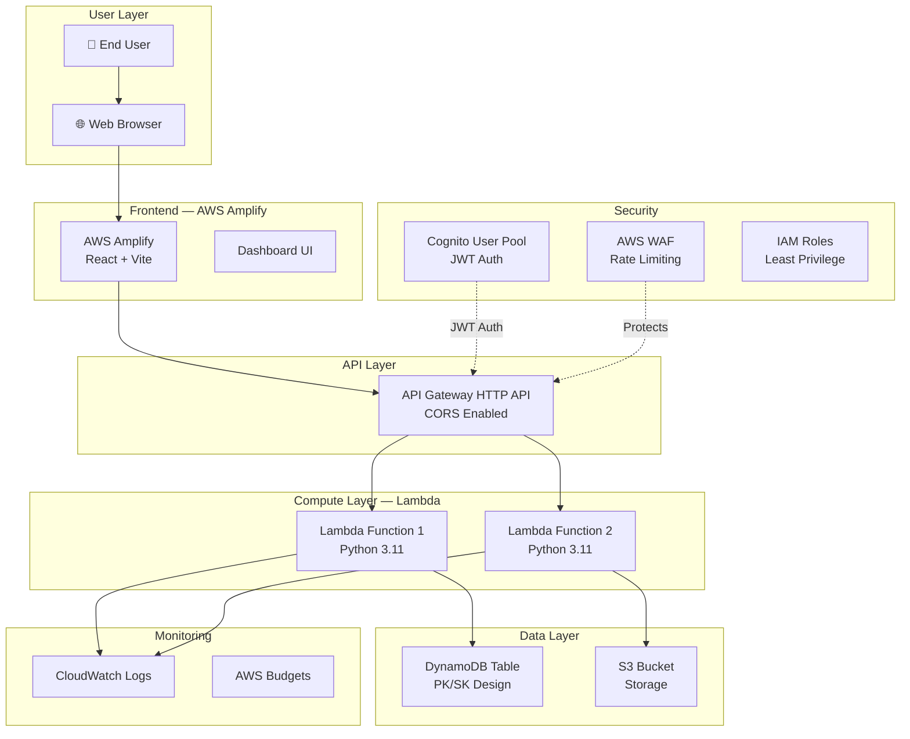

# ☁️ Cloud Project Starter Template

> **Author:** Lawrence (DarkTracer Standard)
> **Version:** 1.0
> **Last Updated:** 2026-03-28
> **Purpose:** Reusable template & checklist for spinning up new AWS cloud projects with professional structure, documentation, and best practices.

---

## 📋 Table of Contents

1. [Quick Start Checklist](#-quick-start-checklist)
2. [Folder Structure](#-folder-structure)
3. [Naming Convention](#-naming-convention)
4. [Required Files Checklist](#-required-files-checklist)
5. [README Template](#-readme-template)
6. [Architecture Diagram Template](#-architecture-diagram-template)
7. [Security Diagram Template](#-security-diagram-template)
8. [Changelog Template](#-changelog-template)
9. [Roadmap Template](#-roadmap-template)
10. [Cost Optimization Template](#-cost-optimization-template)
11. [Future Optimizations Template](#-future-optimizations-template)
12. [Terraform File Standards](#-terraform-file-standards)
13. [Git & CI/CD Setup](#-git--cicd-setup)
14. [Tagging Strategy](#-tagging-strategy)
15. [Budget Alerts Template](#-budget-alerts-template)
15. [Post-Deploy Validation](#-post-deploy-validation)

---

## ⚡ Quick Start Checklist

Use this when creating any new cloud project:

```
☐  1. Create GitHub repo (private → public later)
☐  2. Set up folder structure (see below)
☐  3. Initialize Terraform (provider.tf, variables.tf, locals.tf, main.tf, outputs.tf)
☐  4. Create .gitignore (secrets, state, keys, node_modules)
☐  5. Create README.md (use template below)
☐  6. Create CHANGELOG.md (start at v0.1)
☐  7. Create ROADMAP.md (phases with checkboxes)
☐  8. Create architecture diagram (Mermaid + PNG)
☐  9. Create security diagram (ASCII or Mermaid)
☐ 10. Set up naming convention in locals.tf
☐ 11. Set up common tags in variables.tf
☐ 12. Create terraform.tfvars.example (NO real secrets)
☐ 13. Set up budget alerts ($10/$25/$50 thresholds)
☐ 14. Set up GitHub Actions (Gitleaks secret scanning)
☐ 15. Create COST-OPTIMIZATION.md
☐ 16. Create FUTURE-OPTIMIZATIONS.md
☐ 17. First commit: "Initial project scaffold"
```

---

## 📁 Folder Structure

```
project-root/
│
├── README.md                    # Project overview, setup, screenshots
├── CHANGELOG.md                 # Version history (newest first)
├── ROADMAP.md                   # Phased development plan
├── COST-OPTIMIZATION.md         # AWS cost tracking & strategies
├── FUTURE-OPTIMIZATIONS.md      # Priority list, future features, tech debt
├── .gitignore                   # Secrets, state, keys, deps
├── package.json                 # (if frontend exists)
│
├── Diagram/                     # All architecture & design docs
│   ├── architecture-diagram.md  #   Mermaid diagram + explanation
│   ├── architecture.png         #   Exported PNG for README
│   ├── security-diagram.md      #   Security layers & controls
│   └── backend-flow.md          #   Data flow documentation
│
├── docs/                        # Additional documentation
│   ├── screenshots/             #   Dashboard/UI screenshots
│   ├── DEPLOY-GUIDE.md          #   Step-by-step deployment
│   ├── API-REFERENCE.md         #   API endpoints documentation
│   └── TROUBLESHOOTING.md       #   Common issues & fixes
│
├── frontend/                    # Frontend application
│   ├── src/
│   ├── public/
│   ├── amplify.yml              #   (if using Amplify)
│   ├── package.json
│   └── .env.example             #   Environment variables template
│
├── backend/                     # Backend application (if applicable)
│   ├── routes/
│   └── server.js
│
├── lambda/                      # Lambda function source code
│   ├── function_name/
│   │   └── handler.py
│   └── shared/                  #   Shared utilities across Lambdas
│
├── scripts/                     # Utility & deployment scripts
│   ├── deploy.sh
│   ├── rollback.sh
│   └── test-*.sh
│
├── terraform/                   # (optional) Terraform subfolder
│   └── modules/                 #   Reusable Terraform modules
│
├── .github/                     # GitHub config
│   └── workflows/
│       ├── gitleaks.yml         #   Secret scanning
│       └── terraform.yml        #   Terraform plan/apply CI
│
│── *.tf                         # Terraform files (root level)
│   ├── provider.tf              #   Provider & backend config
│   ├── variables.tf             #   All variable declarations
│   ├── locals.tf                #   Naming convention & computed values
│   ├── main.tf                  #   Core infrastructure
│   ├── outputs.tf               #   Output values
│   ├── security.tf              #   IAM, SGs, encryption
│   ├── budget_alerts.tf         #   Cost monitoring
│   └── <service>.tf             #   One .tf per AWS service
│
├── terraform.tfvars.example     # Example variables (NO secrets)
├── terraform.tfstate.d/         # Workspaces (gitignored)
└── codes/                       # Command reference cheat sheets
    ├── Terraform Commands.sh
    ├── AWS S3 Commands.sh
    ├── Git commands.sh
    └── SSH & Git Setup.sh
```

---

## 🏷️ Naming Convention

### DarkTracer Standard

Every AWS resource follows a consistent pattern for professional, portfolio-ready infrastructure.

### Pattern
```
{project-name}-{resource-type}-{environment}
```

### Implementation in `locals.tf`
```hcl
# ===========================================================
#                     [PROJECT NAME]
#                     Local Values Configuration
# ===========================================================
# Naming Convention: {project-name}-{resource-type}-{environment}
# Example: myproject-lambda-api-dev
# ===========================================================

locals {
  name_prefix = "${var.project_name}-${var.environment}"

  # Common tags applied to every resource
  common_tags = {
    Project     = var.project_name
    Environment = var.environment
    ManagedBy   = "terraform"
    Owner       = "lawrence"
    CostCenter  = var.project_name
  }
}
```

### Implementation in `variables.tf`
```hcl
variable "project_name" {
  description = "Project name used in resource naming"
  type        = string
  # default   = "myproject"   ← set in terraform.tfvars
}

variable "environment" {
  description = "Deployment environment"
  type        = string
  default     = "dev"
  validation {
    condition     = contains(["dev", "staging", "prod"], var.environment)
    error_message = "Environment must be dev, staging, or prod."
  }
}

variable "aws_region" {
  description = "AWS region to deploy to"
  type        = string
  default     = "us-east-1"
}

variable "common_tags" {
  description = "Common tags applied to all resources"
  type        = map(string)
  default = {
    ManagedBy = "terraform"
  }
}
```

### Naming Examples Table

| Resource Type       | Name                                | Pattern                                      |
|---------------------|-------------------------------------|----------------------------------------------|
| **Lambda Function** | `myproject-lambda-api-dev`          | `{project}-lambda-{purpose}-{env}`           |
| **IAM Role**        | `myproject-lambda-api-role-dev`     | `{project}-{service}-{purpose}-role-{env}`   |
| **DynamoDB Table**  | `myproject-dynamodb-events-dev`     | `{project}-dynamodb-{table}-{env}`           |
| **S3 Bucket**       | `myproject-s3-logs-dev`             | `{project}-s3-{purpose}-{env}`               |
| **Security Group**  | `myproject-ec2-web-sg-dev`          | `{project}-{service}-{purpose}-sg-{env}`     |
| **CloudWatch Log**  | `/myproject/lambda/api`             | `/{project}/{service}/{function}`            |
| **API Gateway**     | `myproject-api-dev`                 | `{project}-api-{env}`                        |
| **Cognito Pool**    | `myproject-cognito-users-dev`       | `{project}-cognito-{pool}-{env}`             |
| **EC2 Instance**    | `myproject-ec2-web-dev`             | `{project}-ec2-{purpose}-{env}`              |
| **WAF ACL**         | `myproject-waf-acl-dev`             | `{project}-waf-{type}-{env}`                 |
| **Budget**          | `myproject-budget-monthly-dev`      | `{project}-budget-{type}-{env}`              |
| **SNS Topic**       | `myproject-sns-alerts-dev`          | `{project}-sns-{purpose}-{env}`              |

### Environment Values
| Code      | Use                        |
|-----------|----------------------------|
| `dev`     | Development & testing      |
| `staging` | Pre-production validation  |
| `prod`    | Live production            |

---

## 📄 Required Files Checklist

### Tier 1 — Must Have (Day 1)
| File | Purpose |
|------|---------|
| `README.md` | Project overview, features, setup, screenshots |
| `CHANGELOG.md` | Version history, what changed and when |
| `.gitignore` | Protect secrets, state files, keys, deps |
| `provider.tf` | AWS provider, required providers, backend |
| `variables.tf` | All input variables with descriptions |
| `locals.tf` | Naming convention, computed values |
| `main.tf` | Core resources |
| `outputs.tf` | Important output values |
| `terraform.tfvars.example` | Safe example config (no real secrets) |

### Tier 2 — Should Have (Week 1)
| File | Purpose |
|------|---------|
| `ROADMAP.md` | Phased development plan with checkboxes |
| `COST-OPTIMIZATION.md` | Track AWS costs and savings |
| `FUTURE-OPTIMIZATIONS.md` | Priority backlog, future features, tech debt |
| `Diagram/architecture-diagram.md` | Mermaid architecture diagram |
| `Diagram/security-diagram.md` | Security layers documentation |
| `security.tf` | IAM roles, SGs, encryption |
| `budget_alerts.tf` | AWS Budget monitoring |
| `.github/workflows/gitleaks.yml` | Secret scanning CI |

### Tier 3 — Nice to Have (Ongoing)
| File | Purpose |
|------|---------|
| `docs/DEPLOY-GUIDE.md` | Step-by-step deployment instructions |
| `docs/API-REFERENCE.md` | API endpoint documentation |
| `docs/TROUBLESHOOTING.md` | Common problems & fixes |
| `Diagram/backend-flow.md` | Data flow documentation |
| `codes/*.sh` | Command reference cheat sheets |
| `scripts/deploy.sh` | Automated deploy script |
| `scripts/rollback.sh` | Rollback procedures |

---

## 📝 README Template

Copy this and replace `[PROJECT_NAME]` / `[project-name]` with your actual project name:

````markdown
# [PROJECT_NAME]

[One-line description of what the project does.]

---

## Table of Contents

1. [Introduction](#introduction)
2. [Screenshots](#screenshots)
3. [Features](#features)
4. [Architecture Overview](#architecture-overview)
5. [Architecture Diagram](#architecture-diagram)
6. [Technologies Used](#technologies-used)
7. [Naming Convention](#naming-convention)
8. [Prerequisites](#prerequisites)
9. [Setup & Deployment](#setup--deployment)
10. [Usage](#usage)
11. [Cost Estimate](#cost-estimate)
12. [Future Enhancements](#future-enhancements)

---

## Introduction

**[PROJECT_NAME]** is a [description]. Built on AWS with [key technologies].

---

## Screenshots

### [Page/Feature 1]


### [Page/Feature 2]


---

## Features

### Core Platform
- **Feature 1** — Description
- **Feature 2** — Description

### Data Pipeline
- **Feature 3** — Description

### Security
- **Feature 4** — Description

### Frontend
- **Feature 5** — Description

---

## Architecture Overview

1. **[Component 1]** does X
2. **[Component 2]** does Y
3. **[Component 3]** does Z

---

## Architecture Diagram


**Data Flow:**
```
[User] → [Frontend] → [API Gateway] → [Lambda] → [Database]
                                                → [Storage]
```

---

## Technologies Used

### AWS Services
- **AWS Lambda** — [purpose]
- **Amazon DynamoDB** — [purpose]
- **API Gateway** — [purpose]
- **Amazon S3** — [purpose]
- **Amazon CloudWatch** — [purpose]
- **AWS IAM** — [purpose]

### Application Stack
- **[Framework]** — [purpose]
- **Terraform** — Infrastructure as Code
- **Python 3.11** / **Node.js 18** — Runtime

---

## Naming Convention

**Pattern:** `{project-name}-{resource-type}-{environment}`

| Resource | Example |
|----------|---------|
| Lambda | `[project-name]-lambda-api-dev` |
| DynamoDB | `[project-name]-dynamodb-events-dev` |
| S3 | `[project-name]-s3-logs-dev` |
| IAM Role | `[project-name]-lambda-api-role-dev` |

**Environments:** `dev` · `staging` · `prod`

---

## Prerequisites

- AWS Account with CLI configured
- Terraform >= 1.5
- Node.js >= 18 (if frontend)
- Python >= 3.11 (if Lambda)
- Git

---

## Setup & Deployment

```bash
# 1. Clone the repository
git clone https://github.com/[USERNAME]/[repo-name].git
cd [repo-name]

# 2. Configure variables
cp terraform.tfvars.example terraform.tfvars
# Edit terraform.tfvars with your values

# 3. Initialize Terraform
terraform init

# 4. Plan deployment
terraform plan -out=tfplan

# 5. Apply infrastructure
terraform apply tfplan

# 6. (If frontend) Install & deploy
cd frontend && npm install && npm run build
```

---

## Cost Estimate

| Service | Monthly Cost |
|---------|-------------|
| Lambda | ~$3-5 |
| DynamoDB | ~$5-10 |
| S3 | ~$1 |
| CloudWatch | ~$2-3 |
| **Total** | **~$XX/month** |

See [COST-OPTIMIZATION.md](COST-OPTIMIZATION.md) for details.

---

## Future Enhancements

See [ROADMAP.md](ROADMAP.md) for the full development plan.
````

---

## 🏗️ Architecture Diagram Template

Create `Diagram/architecture-diagram.md`:

````markdown
# [PROJECT_NAME] — Architecture Diagram

## System Architecture Overview



## Component Details

| Component | Service | Purpose |
|-----------|---------|---------|
| Frontend  | Amplify | Hosts React dashboard |
| API       | API Gateway | Routes HTTP requests |
| Compute   | Lambda  | Business logic |
| Database  | DynamoDB | Primary data store |
| Storage   | S3      | File/log archive |
| Auth      | Cognito | User authentication |
| Security  | WAF     | API protection |
| Monitoring| CloudWatch | Logs & metrics |

## Data Flow

```
[User] → [Amplify (React)] → [API Gateway + WAF + Cognito]
                                      │
                            ┌─────────┴─────────┐
                            ▼                   ▼
                      [Lambda Fn 1]       [Lambda Fn 2]
                            │                   │
                      [DynamoDB]             [S3 Bucket]
                            │
                      [CloudWatch]
```
````

---

## 🔒 Security Diagram Template

Create `Diagram/security-diagram.md`:

````markdown
# [PROJECT_NAME] — Security Architecture

## 🔒 Security Layers Overview

```
┌─────────────────────────────────────────────────────────────────┐
│                        INTERNET / USERS                          │
└──────────┬──────────────────────────────────────────────────────┘
           │
           ▼
┌──────────────────────────────────────────────────────────────────┐
│   LAYER 1: EDGE SECURITY — AWS WAF                               │
│                                                                   │
│   • Rate Limiting (per-IP throttle)                              │
│   • SQL Injection Protection                                     │
│   • XSS Protection                                               │
│   • IP Blocklist / Allowlist                                     │
│   • Geo Blocking (optional)                                      │
│   • Bot Control (optional)                                       │
│   • Logging → CloudWatch                                         │
└──────────┬───────────────────────────────────────────────────────┘
           │ Allowed requests only
           ▼
┌──────────────────────────────────────────────────────────────────┐
│   LAYER 2: AUTHENTICATION — AWS COGNITO                          │
│                                                                   │
│   • User Pool with password policy                               │
│     - Min 12 characters                                          │
│     - Uppercase + lowercase + numbers + symbols                  │
│   • JWT Tokens (access + ID + refresh)                           │
│   • Email verification                                           │
│   • Token expiry: 1hr access, 30d refresh                        │
└──────────┬───────────────────────────────────────────────────────┘
           │ Authenticated + Authorized
           ▼
┌──────────────────────────────────────────────────────────────────┐
│   LAYER 3: API GATEWAY                                           │
│                                                                   │
│   • CORS: Restricted to frontend origin only                     │
│   • JWT Authorizer (validates Cognito tokens)                    │
│   • Request/Response logging → CloudWatch                        │
│   • Stage: prod (auto-deploy)                                    │
└──────────┬───────────────────────────────────────────────────────┘
           │
           ▼
┌──────────────────────────────────────────────────────────────────┐
│   LAYER 4: COMPUTE — LAMBDA (LEAST PRIVILEGE)                    │
│                                                                   │
│   • Each function has its own IAM role                           │
│   • Scoped to ONLY the resources it needs                        │
│   • CloudWatch logging per function                              │
│   • Environment variables (no hardcoded secrets)                 │
│   • VPC placement (optional, for DB access)                      │
└──────────┬───────────────────────────────────────────────────────┘
           │
           ▼
┌──────────────────────────────────────────────────────────────────┐
│   LAYER 5: DATA — ENCRYPTION & ACCESS CONTROL                   │
│                                                                   │
│   • DynamoDB: Encryption at rest (AWS managed keys)              │
│   • S3: Server-side encryption (SSE-S3 or SSE-KMS)              │
│   • S3: Block public access enabled                              │
│   • S3: Versioning enabled                                       │
│   • DynamoDB: TTL for automatic data expiry                      │
│   • Secrets: Stored in SSM Parameter Store / Secrets Manager     │
└──────────────────────────────────────────────────────────────────┘

┌──────────────────────────────────────────────────────────────────┐
│   CROSS-CUTTING: MONITORING & COMPLIANCE                         │
│                                                                   │
│   • CloudWatch Logs (all services)                               │
│   • CloudWatch Alarms (error rates, latency)                     │
│   • AWS Budget Alerts ($X/$Y/$Z thresholds)                      │
│   • IAM Access Analyzer (external access detection)              │
│   • GitHub Actions: Gitleaks secret scanning on every push       │
│   • .gitignore: *.tfstate, *.pem, .env, terraform.tfvars        │
└──────────────────────────────────────────────────────────────────┘
```

## Security Controls Checklist

| Control | Status | Notes |
|---------|--------|-------|
| WAF enabled | ☐ | Rate limiting + managed rules |
| Cognito auth | ☐ | JWT-based, email verification |
| CORS restricted | ☐ | Frontend origin only |
| Least-privilege IAM | ☐ | Per-function roles |
| Encryption at rest | ☐ | DynamoDB + S3 |
| No hardcoded secrets | ☐ | Env vars + SSM |
| Secret scanning CI | ☐ | Gitleaks on push |
| Budget alerts | ☐ | Multi-threshold |
| Log retention policy | ☐ | 7-30 day retention |
| S3 public access blocked | ☐ | Account-level block |
````

---

## 📜 Changelog Template

Create `CHANGELOG.md`:

```markdown
# Changelog

All notable changes to this project will be documented in this file.
Format: [Semantic Version] - YYYY-MM-DD

---

## [v0.1] - YYYY-MM-DD

### Initial project scaffold

- Created Terraform infrastructure: `provider.tf`, `variables.tf`, `locals.tf`, `main.tf`, `outputs.tf`
- Set up DarkTracer naming convention: `{project}-{resource}-{env}`
- Created `.gitignore` with secrets protection (*.tfstate, *.pem, .env, terraform.tfvars)
- Added `terraform.tfvars.example` with safe placeholder values
- Set up budget alerts at $X/$Y/$Z thresholds
- Created architecture diagram (Mermaid + PNG)
- Created security diagram with 5-layer model
- Added GitHub Actions: Gitleaks secret scanning
- Initial documentation: README.md, ROADMAP.md, COST-OPTIMIZATION.md

---

<!-- TEMPLATE for future entries:

## [vX.X] - YYYY-MM-DD

### Title of what changed

- **Component** (`file.tf`): What changed and why
- **Impact**: What this means for the system
- **Cost**: Cost impact if any

-->
```

---

## 🗺️ Roadmap Template

Create `ROADMAP.md`:

```markdown
# 🚀 [PROJECT_NAME] Roadmap

---

## 🛠️ PHASE 1: Foundation (Week 1-2)

### Infrastructure
- [ ] Deploy core Terraform infrastructure
- [ ] Set up IAM roles with least privilege
- [ ] Configure CloudWatch logging
- [ ] Set up budget alerts
- [ ] Verify end-to-end data flow

### Documentation
- [ ] Complete README with screenshots
- [ ] Architecture diagram finalized
- [ ] Security diagram finalized

---

## 📊 PHASE 2: Core Features (Week 3-4)

### Backend
- [ ] Implement Lambda functions
- [ ] Set up DynamoDB tables with indexes
- [ ] Create API Gateway routes
- [ ] Add Cognito authentication

### Frontend
- [ ] Set up React app with Vite
- [ ] Build dashboard components
- [ ] Connect to API endpoints
- [ ] Add loading states & error handling

---

## 🔒 PHASE 3: Security & Polish (Week 5-6)

### Security
- [ ] Enable WAF with managed rules
- [ ] Add rate limiting
- [ ] Implement CORS restrictions
- [ ] Set up secret scanning CI

### Optimization
- [ ] Lambda memory right-sizing
- [ ] DynamoDB capacity optimization
- [ ] CloudWatch log retention tuning
- [ ] Cost review and documentation

---

## 🚀 PHASE 4: Production Ready (Week 7-8)

### Deployment
- [ ] Set up multi-environment (dev/staging/prod)
- [ ] Create CI/CD pipeline
- [ ] Add monitoring dashboards
- [ ] Performance testing
- [ ] Document deployment procedures

### Portfolio
- [ ] Clean up code for public repo
- [ ] Add demo screenshots
- [ ] Write project blog post
- [ ] Record demo video
```

---

## 💰 Cost Optimization Template

Create `COST-OPTIMIZATION.md`:

```markdown
# 💰 Cost Optimization Guide

---

## 📊 Current Cost Estimate

### Monthly Costs
| Service | Spec | Cost |
|---------|------|------|
| EC2 | t3a.small | ~$15/month |
| Lambda | 128-256MB | ~$3-5/month |
| DynamoDB | On-demand | ~$5-10/month |
| CloudWatch | 7-day retention | ~$2-3/month |
| API Gateway | HTTP API | ~$3/month |
| S3 | Standard | ~$1/month |
| **Total** | | **~$30-40/month** |

---

## ✅ Implemented Optimizations

### 1. [Optimization Name] 💵 **Saves ~$X/month**
- **Changed:** [before] → [after]
- **Reason:** [why]
- **File:** `[filename.tf]`

---

## 🚀 Future Optimization Opportunities

### 1. EC2 Savings Plans — Potential ~$X/month
- 1-year commit = 30-40% discount

### 2. Spot Instances — Potential ~$X/month
- If workload can tolerate interruptions

### 3. S3 Lifecycle Policies — Potential ~$X/month
- Standard → IA (30d) → Glacier (90d)

### 4. DynamoDB Provisioned — Potential ~$X/month
- Switch from on-demand if traffic is predictable

---

## 📏 Cost Monitoring

- AWS Budget alerts at: $[X] / $[Y] / $[Z]
- Review costs weekly in AWS Cost Explorer
- Tag all resources for cost allocation
```

---

## � Future Optimizations Template

Create `FUTURE-OPTIMIZATIONS.md`:

This is your **living backlog** — different from ROADMAP (which is your planned phases) and COST-OPTIMIZATION (which is money-focused). This tracks everything: priority ranking, feature ideas, tech debt, infrastructure upgrades, and what to work on next.

```markdown
# 🚀 Future Optimizations & Enhancements

This document tracks improvements to implement after core features are complete.

---

## 🔄 **Status: [Current Phase] — [Status Summary]**

[One line describing where the project is right now.]

---

## 🎯 **PRIORITY LIST — What To Focus On Next**

> Philosophy: Ship a polished, demo-able product first → then optimize infrastructure.

### 🔴 High Priority (Do Now)
- [ ] **[Task 1]** — [Why it matters and what's blocking without it]
- [ ] **[Task 2]** — [Description]
- [ ] **[Task 3]** — [Description]

### 🟡 Medium Priority (Next Sprint)
- [ ] **[Task 4]** — [Description]. Do after [dependency].
- [ ] **[Task 5]** — [Description]

### 🟢 Low Priority (Backlog)
- [ ] **[Task 6]** — [Description]. Important for scaling but premature now.
- [ ] **[Task 7]** — [Description]

---

## 📝 **Next Up — Working Tasks**

> Smaller tasks and improvements to knock out as time allows.

- [ ] **[Small task 1]** — [Description]
- [ ] **[Small task 2]** — [Description]

---

## 📋 **Phase 1: Core Features**

- [x] [Completed feature 1] ✅ *(version/date)*
- [x] [Completed feature 2] ✅ *(details)*
- [ ] [Remaining task]

---

## ⚡ **Phase 2: CI/CD & Automation**

- [ ] Terraform validation workflow (fmt, validate, plan)
- [ ] Frontend build & test workflow
- [ ] Dependency scanning (Dependabot)
- [ ] Code quality checks (linting, formatting)

---

## 🏗️ **Phase 3: AWS Well-Architected Framework**

### Security Pillar
- [ ] Secret scanning CI
- [ ] WAF integration
- [ ] Cognito authentication
- [ ] Security Hub / GuardDuty

### Cost Optimization Pillar
- [ ] Lambda memory right-sizing
- [ ] Log retention tuning
- [ ] Resource tagging for cost allocation
- [ ] Budget alerts

### Performance Pillar
- [ ] Caching strategies (CloudFront, API Gateway)
- [ ] Lambda cold start optimization
- [ ] Frontend code splitting & lazy loading

### Operational Excellence Pillar
- [ ] Comprehensive logging
- [ ] CloudWatch dashboards
- [ ] Runbooks for common issues
- [ ] Incident response procedures

### Reliability Pillar
- [ ] Multi-AZ deployment
- [ ] Automated backups & restore testing
- [ ] Disaster recovery plan
- [ ] Blue/green deployments

---

## 🔄 **Terraform Provider Updates**

> **Reference:** [Terraform AWS Provider Registry](https://registry.terraform.io/providers/hashicorp/aws/latest/docs) · [GitHub Releases](https://github.com/hashicorp/terraform-provider-aws/releases)

### Current State
- **Project is on:** `~> X.X` (in `provider.tf`)
- **Latest available:** `vX.X.X` (check link above)

### 📋 Upgrade Checklist
- [ ] Read the migration guide for major version jumps
- [ ] Create dedicated branch: `feature/terraform-vX-upgrade`
- [ ] Run `terraform init -upgrade`
- [ ] Run `terraform plan` — review ALL changes
- [ ] Test in dev environment first
- [ ] Verify all resources work
- [ ] Merge to Dev → staging → prod

---

## 🔐 **Security Enhancements**

- [ ] GuardDuty
- [ ] AWS Config for compliance
- [ ] Secrets rotation (Secrets Manager)
- [ ] VPC Flow Logs analysis
- [ ] Penetration testing
- [ ] Security certifications (SOC2, ISO 27001)

---

## 📝 **Documentation Improvements**

- [ ] Architecture decision records (ADRs)
- [ ] API documentation (OpenAPI/Swagger)
- [ ] User guides and tutorials
- [ ] Video walkthroughs

---

## 📅 **Review Schedule**

- **Monthly:** Review and prioritize items
- **Quarterly:** Assess progress and adjust priorities
- **Annually:** Major architecture review

---

## 📌 **Notes**

- Focus on **shipping a polished product** before optimizing
- Don't over-engineer early — implement when needed
- Measure before optimizing — use data to guide decisions
- Keep security and reliability as ongoing priorities

---

**Last Updated:** YYYY-MM-DD
**Status:** [Current status summary]
```

---

## �🔧 Terraform File Standards

### File Organization — One `.tf` per Service

| File | Purpose |
|------|---------|
| `provider.tf` | AWS provider, required providers, backend config |
| `variables.tf` | ALL input variables with descriptions & validation |
| `locals.tf` | Naming convention, computed values, common tags |
| `main.tf` | Core/shared resources (VPC, subnets, etc.) |
| `outputs.tf` | All output values |
| `security.tf` | IAM roles, security groups, KMS keys |
| `cognito.tf` | Cognito user pool, identity pool, app client |
| `api_gateway.tf` | API Gateway, routes, integrations |
| `lambda_[name].tf` | One file per Lambda (or grouped by domain) |
| `dynamodb.tf` | DynamoDB tables, GSIs, TTL |
| `s3.tf` | S3 buckets, policies, lifecycle |
| `waf.tf` | WAF Web ACL, rules, IP sets |
| `cloudwatch.tf` | Log groups, alarms, dashboards |
| `budget_alerts.tf` | AWS Budgets + SNS notifications |
| `frontend_env.tf` | Auto-generate frontend .env from Terraform outputs |

### File Header Template

```hcl
# ===========================================================
#                     [PROJECT NAME]
#                     [Resource Description]
# ===========================================================
# Description: [What this file creates and why]
#
# Resources:
#   - [Resource 1]
#   - [Resource 2]
#
# Naming: {project}-{resource}-{env}
# Last Updated: YYYY-MM-DD
# ===========================================================
```

### `provider.tf` Starter

> **⚠️ Always check for the latest provider version before starting a new project:**
> - 📦 [Terraform AWS Provider Registry](https://registry.terraform.io/providers/hashicorp/aws/latest/docs)
> - 📋 [GitHub Releases & Changelog](https://github.com/hashicorp/terraform-provider-aws/releases)
> - 🔄 See [FUTURE-OPTIMIZATIONS.md → Terraform Provider Updates](../FUTURE-OPTIMIZATIONS.md#-terraform-provider-updates) for upgrade checklist
>
> **As of March 2026:** Latest is `v6.38.0`. Check the link above for the current latest before pinning.

```hcl
# ===========================================================
#                     [PROJECT NAME]
#                     Provider Configuration
# ===========================================================

terraform {
  required_version = ">= 1.5"

  required_providers {
    aws = {
      source  = "hashicorp/aws"
      # CHECK LATEST: https://registry.terraform.io/providers/hashicorp/aws/latest
      version = "~> 6.0"   # ← Update to latest major version for new projects
    }
  }

  # Uncomment for remote state:
  # backend "s3" {
  #   bucket         = "[project]-terraform-state"
  #   key            = "terraform.tfstate"
  #   region         = "us-east-1"
  #   dynamodb_table = "[project]-terraform-locks"
  #   encrypt        = true
  # }
}

provider "aws" {
  region = var.aws_region

  default_tags {
    tags = {
      Project     = var.project_name
      Environment = var.environment
      ManagedBy   = "terraform"
    }
  }
}
```

### `terraform.tfvars.example`

```hcl
# ===========================================================
# [PROJECT NAME] — Terraform Variables
# ===========================================================
# Copy this file to terraform.tfvars and fill in real values
# NEVER commit terraform.tfvars to git!
# ===========================================================

project_name = "myproject"
environment  = "dev"
aws_region   = "us-east-1"

# key_pair_name = "my-key-pair"
# alert_email   = "you@example.com"
```

---

## 🔐 Git & CI/CD Setup

### `.gitignore` Template

```gitignore
# ===== Terraform =====
*.tfstate
*.tfstate.*
*.tfstate.d/
terraform.tfstate.d/
*.tfplan
tfplan*
.terraform/
.terraform.lock.hcl
terraform.tfvars          # Contains real secrets
crash.log

# ===== Secrets & Keys =====
*.pem
*.key
.env
.env.local
.env.production

# ===== Dependencies =====
node_modules/
__pycache__/
*.pyc
.venv/
venv/

# ===== IDE =====
.vscode/settings.json
.idea/

# ===== OS =====
.DS_Store
Thumbs.db

# ===== Build =====
dist/
build/
*.zip
```

### GitHub Actions — Gitleaks Secret Scanning

Create `.github/workflows/gitleaks.yml`:

```yaml
name: Gitleaks Secret Scan

on:
  push:
    branches: ["*"]
  pull_request:
    branches: [main, Dev]

jobs:
  gitleaks:
    name: Scan for Secrets
    runs-on: ubuntu-latest
    steps:
      - uses: actions/checkout@v4
        with:
          fetch-depth: 0

      - uses: gitleaks/gitleaks-action@v2
        env:
          GITHUB_TOKEN: ${{ secrets.GITHUB_TOKEN }}
```

### GitHub Actions — Terraform Plan

Create `.github/workflows/terraform.yml`:

```yaml
name: Terraform Plan

on:
  pull_request:
    branches: [main]
    paths: ["*.tf", "*.tfvars.example"]

jobs:
  plan:
    name: Terraform Plan
    runs-on: ubuntu-latest
    steps:
      - uses: actions/checkout@v4

      - uses: hashicorp/setup-terraform@v3
        with:
          terraform_version: "1.7"

      - name: Terraform Init
        run: terraform init

      - name: Terraform Format Check
        run: terraform fmt -check

      - name: Terraform Validate
        run: terraform validate

      - name: Terraform Plan
        run: terraform plan -no-color
        env:
          AWS_ACCESS_KEY_ID: ${{ secrets.AWS_ACCESS_KEY_ID }}
          AWS_SECRET_ACCESS_KEY: ${{ secrets.AWS_SECRET_ACCESS_KEY }}
```

---

## 🏷️ Tagging Strategy

Apply these tags to **every** AWS resource:

```hcl
tags = merge(local.common_tags, {
  Name      = "${local.name_prefix}-[resource-description]"
  Component = "[component-name]"    # e.g., "api", "database", "frontend"
  CostCenter = var.project_name     # For cost allocation reports
})
```

### Standard Tags

| Tag Key | Example Value | Purpose |
|---------|---------------|---------|
| `Name` | `myproject-lambda-api-dev` | Resource identification |
| `Project` | `myproject` | Project grouping |
| `Environment` | `dev` | Environment identification |
| `ManagedBy` | `terraform` | Management tool |
| `Owner` | `lawrence` | Responsible person |
| `Component` | `api` | System component |
| `CostCenter` | `myproject` | Cost allocation |

---

## 💸 Budget Alerts Template

### `budget_alerts.tf` Starter

```hcl
# ===========================================================
#                     Budget Alerts
# ===========================================================

resource "aws_budgets_budget" "monthly" {
  name         = "${local.name_prefix}-budget-monthly"
  budget_type  = "COST"
  limit_amount = "50"
  limit_unit   = "USD"
  time_unit    = "MONTHLY"

  notification {
    comparison_operator        = "GREATER_THAN"
    threshold                  = 60      # Alert at 60% ($30)
    threshold_type             = "PERCENTAGE"
    notification_type          = "ACTUAL"
    subscriber_email_addresses = [var.alert_email]
  }

  notification {
    comparison_operator        = "GREATER_THAN"
    threshold                  = 80      # Alert at 80% ($40)
    threshold_type             = "PERCENTAGE"
    notification_type          = "ACTUAL"
    subscriber_email_addresses = [var.alert_email]
  }

  notification {
    comparison_operator        = "GREATER_THAN"
    threshold                  = 100     # Alert at 100% ($50)
    threshold_type             = "PERCENTAGE"
    notification_type          = "ACTUAL"
    subscriber_email_addresses = [var.alert_email]
  }
}
```

---

## ✅ Post-Deploy Validation Checklist

Run through this after every `terraform apply`:

```
☐  terraform output — all values populated
☐  API Gateway — hit health endpoint, get 200
☐  Lambda — check CloudWatch logs, no errors
☐  DynamoDB — table exists, can read/write
☐  S3 — bucket exists, encryption enabled, public access blocked
☐  Cognito — can sign up / sign in test user
☐  WAF — rules active, test rate limiting
☐  CloudWatch — log groups created, logs flowing
☐  Budget — alerts configured, email verified
☐  Frontend — loads in browser, API calls succeed
☐  IAM — no wildcard (*) permissions on production roles
☐  .gitignore — verify no secrets in repo (git log --all -p | grep -i "password\|secret\|key")
```

---

## 🎯 Project Maturity Levels

Track your project's readiness:

### Level 1 — Scaffold ⬜
- [ ] Folder structure created
- [ ] Terraform initialized
- [ ] README exists
- [ ] .gitignore configured

### Level 2 — Foundation 🟨
- [ ] Core infrastructure deployed
- [ ] Naming convention applied
- [ ] Budget alerts active
- [ ] Architecture diagram done

### Level 3 — Functional 🟧
- [ ] All features working end-to-end
- [ ] Security layers implemented
- [ ] Frontend connected to backend
- [ ] CHANGELOG up to date

### Level 4 — Production 🟩
- [ ] Multi-environment support
- [ ] CI/CD pipeline active
- [ ] Monitoring & alerting configured
- [ ] Cost optimized
- [ ] Documentation complete

### Level 5 — Portfolio Ready 🟦
- [ ] Clean public repo
- [ ] Screenshots in README
- [ ] Demo video recorded
- [ ] Blog post written
- [ ] Security diagram polished

---

> **Pro Tip:** When starting a new project, copy this file into the new repo's `docs/` folder and use it as your master checklist. Delete sections you don't need, fill in project-specific details, and check off items as you go.
